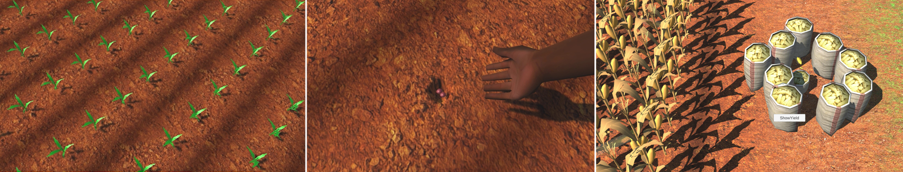

<a href="#what" target="_blank">
  <button style="background-color: #109d0080; color: white; border: none; padding: 5px 5px; text-align: center; text-decoration: none;display: inline-block; font-size: 24px; border-radius: 4px;">
    What?	
  </button>
</a>
<a href="#who" target="_blank">
  <button style="background-color: #109d0080; color: white; border: none; padding: 5px 5px; text-align: center; text-decoration: none;display: inline-block; font-size: 24px; border-radius: 4px;">
    Who?
  </button>
</a>
<a href="#media" target="_blank">
  <button style="background-color: #109d0080; color: white; border: none; padding: 5px 5px; text-align: center; text-decoration: none;display: inline-block; font-size: 24px; border-radius: 4px;">
   Media
  </button>
</a>
<a href="#funding" target="_blank">
  <button style="background-color: #109d0080; color: white; border: none; padding: 5px 5px; text-align: center; text-decoration: none;display: inline-block; font-size: 24px; border-radius: 4px;">
    Funding
  </button>
</a>
    


MahindiMaster is an ambitious project that aims to combine crop modeling, rainfall data and soil information into an app that enables farmers to experiment and learn as they would on their own farm – without risking real investments in purchased inputs. The app enables farmer learning about the complex returns to – and interactions between – different fertilizer and input combinations and soil characteristics, on a virtual field that is calibrated to their own production conditions and context. By making extensive use of animations, we aim to make the app accessible to every type of farmer, including low-literacy smallholder populations, and to enhance the salience of virtual learning setting.

## What is MahindiMaster?<a id="what"></a>

## Who are we?<a id="who"></a>
	  
## Media<a id="media"></a>

## Funding<a id="funding"></a>	  
	  
	  
Text is easy as

Code looks nice in markdown
```python
function = resize(x)
```

Markdown is easy to style
```markdown
# Header 1
## Header 2
### Header 3

- Bulleted
- List

1. Numbered
2. List

**Bold** and _Italic_ and `Code` text

[Link](url) and 
```

For more details see [Basic writing and formatting syntax](https://docs.github.com/en/github/writing-on-github/getting-started-with-writing-and-formatting-on-github/basic-writing-and-formatting-syntax).
